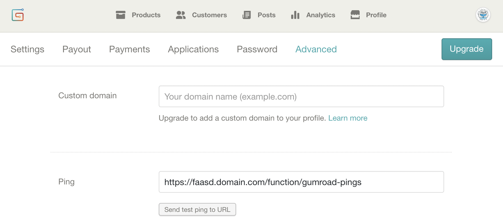
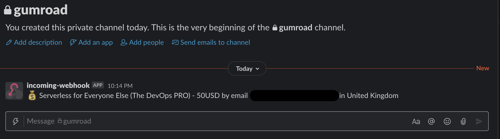

# Get webhooks into Slack every time you sell a product on Gumroad

This repo contains two functions which extend Gumroad with a custom workflow

1) gumroad-pings - forwards messages to Slack to tell you about your sales
2) gumroad-upgrade - use this to email customers an upgrade to a secret unlisted YouTube video or Gist for additional value

## Deployment

First of all, set up OpenFaaS using the open-source [faasd](http://github.com/openfaas/faasd) project.

> My new eBook has step-by-step instructions on how to setup and configure faasd and may save you some time with configuration and setting up TLS: [Serverless For Everyone Else](https://gumroad.com/l/serverless-for-everyone-else).

Then create an incoming webhook URL via [Slack's docs](https://api.slack.com/messaging/webhooks).

Then clone this repo, and create the two secrets.

```bash
faas-cli secret create seller-id --from-literal "GUMROAD_SELLER_ID"
faas-cli secret create slack-url --from-literal "https://hooks.slack.com/services/X/Y/Z"
```

You can get the slack-url by creating an "incoming webhook" and creating a new channel for the messages, or using an existing one.

Set an end-date for your offer in the `promotion_end_date` environment variable, if you don't know what date to set, make the date very far into the future.

```yaml
  gumroad-pings:
...
    environment:
...
      promotion_end_date: '2021-02-13T00:00:00.000Z'
```

Deploy the function after creating the secrets:

```bash
faas-cli deploy --filter gumroad-pings
```

Now enter your function's URL on the Advanced tab in Gumroad's settings page, in the "Ping" field.

Your URL will be something like: `https://faasd.domain.com/function/gumroad-pings`



This is what you'll receive.



Feel free to customise the code in the [handler.js](https://github.com/alexellis/gumroad-sales-forwarder/blob/main/gumroad-pings/handler.js) file.

Why not?
* Send new customers an email using SES or Sendgrid
* Tweet a message to say thanks
* Customise the message into the Slack channel
* Send them an automated invite to your Slack community
* [Flash an LED on your Raspberry Pi](https://levelup.gitconnected.com/add-a-status-led-to-your-raspberry-pi-d3718846d66b)

See the code for the [gumroad-pings](https://github.com/alexellis/gumroad-sales-forwarder/tree/main/gumroad-pings) function

Feel free to customise the code, or reach out on [OpenFaaS Slack](https://slack.openfaas.io/)

### Conditional emails

The gumroad-upgrade function will "upgrade" customers on the 50USD tier by emailing them a link to a video course.

You'll need to set up [AWS Simple Email Service (SES)](https://docs.aws.amazon.com/sdk-for-javascript/v2/developer-guide/ses-examples-sending-email.html) or use an alternative like Sendgrid if you want this functionality in your own workflow.

Create secrets for your AWS credentials:

```bash
export AWS_SES_TOKEN=""
export AWS_SES_SECRET=""

faas-cli secret create \
 ses-access-key-id \
 --from-literal "$AWS_SES_SECRET"

faas-cli secret create \
 ses-access-token \
 --from-literal "$AWS_SES_TOKEN"
```

Create a secret for the URL that you want your customers to go to:

```bash
export SECRET_URL="https://github.com/sponsors/alexellis/"

faas-cli secret create \
 secret-url \
 --from-literal "$SECRET_URL"
```

Customise the email templates in the gumroad-upgrade/emails/ folder - edit the message.html and message.txt so your users can receive both plaintext and HTML.

Update the environment variables for your emails and the AWS region if you're using SES

```yaml
    environment:
      subject: "Your bonus upgrade to my video workshop"
      sender: sales@openfaas.com
      region: "eu-west-1"
```

Here's an example of the HTML message, which you can customise:


See the code for the [gumroad-upgrade](https://github.com/alexellis/gumroad-sales-forwarder/tree/main/gumroad-pings) function

Emails are de-duplicated to prevent you spamming your customers. You can disable this if you wish.

### Sending test emails

```bash
curl http://127.0.0.1:8080/function/gumroad-upgrade \
 --data-binary '{"email": "alex@openfaas.com", "sellerID": "SECRET"}' \
 -H "Content-type: application/json"
```

## Copyright & License

MIT license, copyright [OpenFaaS Ltd](https://openfaas.com/)

